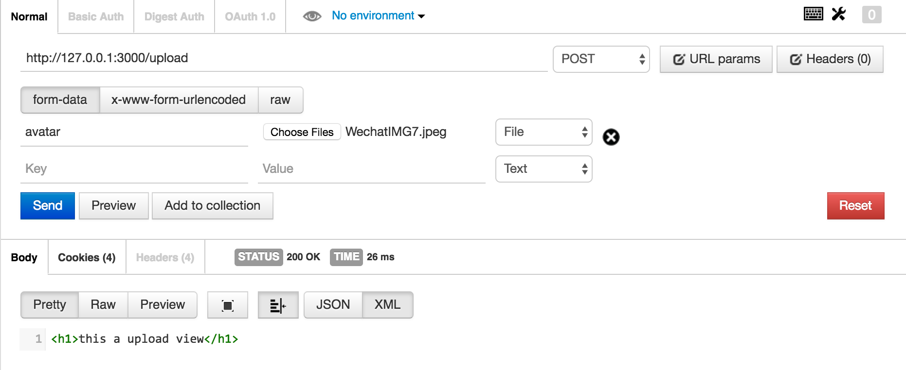

# Getting Start

这里是sletjs结合模板引擎+上传的示例

基于https://github.com/sletjs/example-view，所以view相关不在解释

## 安装slet模块

```
$ npm i -S slet
$ npm i -S slet-viewcontroller
$ npm i -S nunjucks

$ npm i -S slet-uploadviewcontroller
```

## 从app.js开始

```
'use strict';

const Slet = require('slet');
const app = new Slet({
    root: __dirname,
    debug: true,
    upload: { dest: './uploads/'}
});

app.defineController(require('slet-viewcontroller'))
app.defineController(require('slet-uploadviewcontroller'))

app.router('/', require('./viewctrl') )  

app.router('/upload', require('./uploadctrl') )  

app.start(3000) 
```

注意：如果不配置upload选项，会报错的。

## 编写uploadctrl.js

```
'use strict';

const UploadViewController = require('slet').UploadViewController

module.exports = class MyUploadController extends UploadViewController {
  constructor(app, ctx, next) {
    super(app, ctx, next)
    
    this.post_filter = [this.upload.single('avatar')]
  }
  
  post() { 
    return {
      tpl: 'index',
      data: {
        title: 'this a upload view'
      }
    }
  } 
}

```

如果通过`this.renderType = 'default'`也可以实现UploadController的效果

## 启动server

最后，执行app.js，启动server

```
$ node app.js
```

## 查验结果

打开postman

